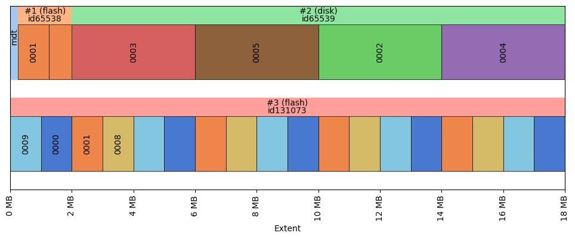

# lustre-stripe-plotter
Graphically display the layout of a Lustre file.
Generate your file's layout YAML using `lfs getstripe -y <filename> > <filename.yaml>`
Run this code to:
- produce a cleaner, consistent, mirror-based YAML
- generate a jpg of the layout

Usage:
  `python striper.py <filename.yaml>`

Some notes:
- OST labels are 4-digit hex.
- Component ID labels are #<id>
- lcme_id labels are id<id>
- If objects are not yet allocated for a component, they are displayed in gray.
- The extents are plotted as far as the last well-defined component, not necessarily the full extent of the file. This is to avoid making the graphic unreadable for large files.
- We only label the OSTs when they are first introduced; thereafter any repeats are just identified by color. This allows a clearer identification of unique objects.
- Overstriped files are similarly colored, but are each explicitly labelled. (Eg. 001A, 001A would indicate two overstripes)
- The size of the first object after a DoM component shoud be drawn smaller by \<DoM size\>. I didn't bother to fix this.
  
Example of mirrored DoM PFL file:
  
